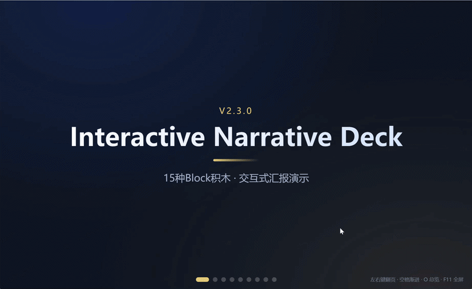

# Interactive Narrative Deck


> 30分钟做出专业汇报演示 · Block积木 + SWOT分析 + OKR树 + 甘特图 + 渐进揭示



---

## ⚡ 3分钟开始

### 1️⃣ 安装
```bash
# Claude Code中安装
/skill install https://github.com/longhuang1997-cpu/interactive-narrative-deck
```

### 2️⃣ 使用
在Claude Code中说：
```
做Q3战略汇报，给董事会看，有SWOT分析，
数据：营收+25%，用户留存78%，新增120家客户
```

Claude自动判断：
- ✅ 受众=董事会 → 结论优先结构
- ✅ 有优劣势分析 → 推荐SWOT Block
- ✅ 数据是亮点 → 用metric数字卡

### 3️⃣ 预览
```bash
# 双击打开
index.html

# 快捷键
左右键 / PageUp/PageDown  # 翻页
空格                      # 渐进揭示
O                         # 总览模式
F11                       # 全屏演示
```

---

## 💡 核心价值

### 不是工具，是汇报经验的AI化

10年汇报者的判断力——向高管先结论、数据对比用图、问题拆解配合节奏——由AI代为执行。

### 对比PPT

| 维度 | PowerPoint | Interactive Deck |
|------|-----------|------------------|
| 制作时间 | 2-4小时 | **30分钟** ⚡ |
| 数据更新 | 逐页改 | **改1处全局更新** 🔄 |
| 交互性 | 静态翻页 | **实时图表+渐进** 🎯 |
| 版本控制 | final_v2_真最终.pptx | **Git diff** 📦 |

**真实场景**：高管说"把上周数据改成本周" → PPT需30分钟，Deck改1处1分钟 ✅

---

## 🧩 15种Block积木

| Block | 用途 | 最佳场景 |
|-------|------|---------|
| `hero` | 封面/章节 | 每页开头 |
| `metric` | 数字指标（滚动动效） | KPI展示 |
| `bullets` | 要点列表（渐进揭示） | 问题分析 |
| `compare` | 左右对比 | 方案选型 |
| `timeline` | 时间线/路线图 | 项目进度 |
| `quote` | 金句/引用 | 行动号召 |
| `chart` | 图表（line/bar/pie） | 趋势分析 |
| `tabs` | 标签页切换 | 多方案并列 |
| `media` | 图片/视频 | 产品截图 |

### 🎯 专业方法论Block

| Block | 用途 | 场景 |
|-------|------|------|
| **`swot`** | **SWOT分析矩阵** | **战略复盘/竞争分析** |
| **`okr`** | **OKR树状图** | **目标管理/战略执行** |
| **`gantt`** | **甘特图** | **项目进度/路线图** |

**v2.1.0新增**：SWOT分析Block，2x2矩阵展示优势/劣势/机会/威胁，适用于季度复盘、新业务评估、竞争分析。

**v2.3.0新增**：OKR树和甘特图两大专业方法论Block，让目标管理和项目进度可视化。OKR树展示目标→关键结果的树状结构+进度条，甘特图展示时间轴+任务条，都带交互动效。

[完整SWOT使用指南 →](knowledge/frameworks/swot-analysis.md)

### 🎨 自定义扩展Block（v2.2.0）

| Block | 用途 | 场景 |
|-------|------|------|
| **`code`** | **代码展示（行号+语法高亮）** | **技术分享/API文档** |
| **`split`** | **左图右文分栏** | **产品介绍/架构说明** |
| **`grid`** | **多列网格卡片（2-4列）** | **能力矩阵/特性并列** |

**v2.2.0新增**：3个自定义Block + 全Block交互动效增强（hover/transition/animation），让每个Block都"会呼吸"。

---

## 📦 3个完整案例

### 1. 战略汇报（给高管）
**路径**：`examples/strategy-report/`  
**结构**：封面 → 数据 → 分析 → 行动  
**页数**：7页

### 2. 技术分享（给团队）
**路径**：`examples/tech-talk/`  
**结构**：背景 → 方案 → Demo → Q&A  
**页数**：8页

### 3. SWOT分析（专业能力展示）
**路径**：`examples/swot-demo/`  
**结构**：封面 → 数据 → SWOT → 战略 → 计划  
**页数**：6页

[查看所有案例 →](examples/)

---

## 🔧 进阶使用

### 自定义Block
从v2.1.0开始，Block采用插件化架构，可扩展自定义Block：

```javascript
BlockRegistry.register('myblock', function(data) {
  const div = document.createElement('div');
  // 自定义渲染逻辑
  return div;
}, {
  description: '我的自定义Block'
});
```

[Block扩展开发指南 →](docs/BLOCK_EXTENSION_GUIDE.md)

### 可视化配置工具
打开 `config_ui/config_ui.html` 进行可视化微调（选择叙事风格、模板类型、视觉效果等）

### 方法论知识库
- [SWOT分析完整指南](knowledge/frameworks/swot-analysis.md)
- [Block参考手册](knowledge/block-reference.md)
- [布局模式选择](knowledge/layout-patterns.md)
- [叙事框架引擎](knowledge/narrative-engine.md)
- [故障排查](knowledge/troubleshooting.md)

---

## 🔒 安全与隐私

✅ **100%本地运行** - 所有内容生成在本地，无数据上传  
✅ **开源可审计** - MIT许可证，代码完全透明  
✅ **CDN失败自动降级** - GSAP/Chart.js加载失败时回退到基础CSS动画  
✅ **无执行权限** - 不运行系统命令，不修改配置

### 权限清单

| 权限类型 | 需要/不需要 | 说明 |
|---------|-----------|------|
| 文件读取 | ❌ | 不读取用户文件系统 |
| 文件写入 | ✅ | 只写入用户指定的输出目录 |
| 网络访问 | ⚠️ | 仅CDN加载GSAP/Chart.js（可完全离线） |
| 系统命令 | ❌ | 不执行任何系统命令 |
| 敏感数据 | ❌ | 不访问环境变量、配置文件 |

### 数据流向

```
用户输入(文本/数据) → Claude生成deck.js → 写入本地HTML → 浏览器渲染
                                   ↓
                              无网络传输
```

[完整安全说明 →](docs/SECURITY_AND_PRIVACY.md)

---

## 🆚 对比类似工具

| 特性 | Interactive Deck | Reveal.js | Marp | Slidev |
|------|-----------------|-----------|------|--------|
| 学习曲线 | AI生成，零代码 | 需要HTML/JS | Markdown | Vue.js |
| SWOT分析 | ✅ 内置 | ❌ | ❌ | ❌ |
| 数据图表 | ✅ Chart.js集成 | 需要插件 | ❌ | 需要配置 |
| 渐进揭示 | ✅ 自动 | 手动配置 | 有限支持 | 手动配置 |
| 翻页笔支持 | ✅ 原生 | ✅ | ⚠️ | ✅ |
| 适用场景 | **商业汇报** | 技术演讲 | 文档演示 | 开发分享 |

**定位差异**：Interactive Deck专注**商业汇报场景**（战略复盘、数据分析、高管汇报），内置SWOT等专业方法论Block，AI自动判断叙事结构。其他工具更适合技术演讲或开发者分享。

---

## 🌐 浏览器兼容性

| 浏览器 | 最低版本 | 状态 | 说明 |
|--------|---------|------|------|
| Chrome | 90+ | ✅ 完全支持 | 推荐使用 |
| Edge | 90+ | ✅ 完全支持 | 推荐使用 |
| Firefox | 88+ | ✅ 完全支持 | - |
| Safari | 14+ | ⚠️ 部分特性降级 | CSS Grid兼容性 |
| IE11 | - | ❌ 不支持 | 不支持ES6 |

**性能指标**：
- 首次加载时间：< 1秒（含CDN）
- 渲染性能：支持50+页流畅翻页
- 离线可用：下载后无需网络

---

## ❓ 常见问题

<details>
<summary><b>图表不显示怎么办？</b></summary>

检查Chart.js CDN是否加载失败：
1. 打开浏览器控制台（F12）
2. 查看Network标签是否有404错误
3. 解决方案：
   - 检查网络连接
   - 或下载Chart.js到本地并修改引用路径

</details>

<details>
<summary><b>如何修改主题颜色？</b></summary>

编辑deck.js中的theme配置：
```javascript
theme: {
  blue: '#2563eb',  // 改成你喜欢的颜色
  gold: '#e8c874',
  bg: '#0b1220'
}
```

或使用可视化配置工具：`config_ui/config_ui.html`

</details>

<details>
<summary><b>支持导出PDF吗？</b></summary>

支持！使用浏览器打印功能：
1. 按F11全屏演示
2. Ctrl/Cmd + P打印
3. 选择"另存为PDF"
4. 调整设置：横向、去掉页眉页脚

</details>

<details>
<summary><b>翻页笔可以用吗？</b></summary>

✅ 完全支持！翻页笔的左右键会触发PageUp/PageDown事件，与键盘操作一致。

</details>

---

## 📚 文档导航

| 类别 | 文档 | 说明 |
|------|------|------|
| **入门** | [3分钟快速开始](#-3分钟开始) | 零基础上手 |
| | [完整案例](examples/) | 3个真实场景Demo |
| | [常见问题](#-常见问题) | FAQ快速解决 |
| **进阶** | [Block参考手册](knowledge/block-reference.md) | 13种Block完整API |
| | [SWOT使用指南](knowledge/frameworks/swot-analysis.md) | SWOT分析完整教程 |
| | [可视化配置工具](config_ui/config_ui.html) | 拖拽式编辑器 |
| | [布局模式选择](knowledge/layout-patterns.md) | center/left/grid/scroll |
| | [叙事框架引擎](knowledge/narrative-engine.md) | AI自动匹配4种框架 |
| **开发** | [Block扩展指南](docs/BLOCK_EXTENSION_GUIDE.md) | 自定义Block开发 |
| | [产品战略路线图](docs/PRODUCT_STRATEGY_ROADMAP.md) | 未来规划 |
| **其他** | [故障排查](knowledge/troubleshooting.md) | 常见问题解决 |
| | [安全与隐私](docs/SECURITY_AND_PRIVACY.md) | 完整安全说明 |
| | [CHANGELOG](CHANGELOG.md) | 版本历史 |
| | [SKILL.md](SKILL.md) | AI调用定义和判断规则 |

---

## 📄 许可证

MIT © 2026 [longhuang1997-cpu](https://github.com/longhuang1997-cpu)

---

## 🚀 产品路线图

- **v2.1.0** - SWOT分析Block + 插件化架构
- **v2.2.0** - code/split/grid自定义Block + 全Block交互动效
- **v2.3.0** (当前) - OKR树 + 甘特图专业方法论Block
- **v3.0.0** (愿景) - 更多专业方法论可视化（鱼骨图/波士顿矩阵/PDCA）

从"演示工具"到"方法论平台"，让专业分析可视化。

---

**GitHub**: https://github.com/longhuang1997-cpu/interactive-narrative-deck  
**技能市场**: [待发布]

---

## 🤝 参与贡献

欢迎贡献代码、报告问题或提出建议！

- 🐛 [报告Bug](https://github.com/longhuang1997-cpu/interactive-narrative-deck/issues)
- 💡 [功能建议](https://github.com/longhuang1997-cpu/interactive-narrative-deck/issues)
- 🔧 [提交PR](https://github.com/longhuang1997-cpu/interactive-narrative-deck/pulls)

贡献前请阅读 [贡献指南](CONTRIBUTING.md)（如有）
