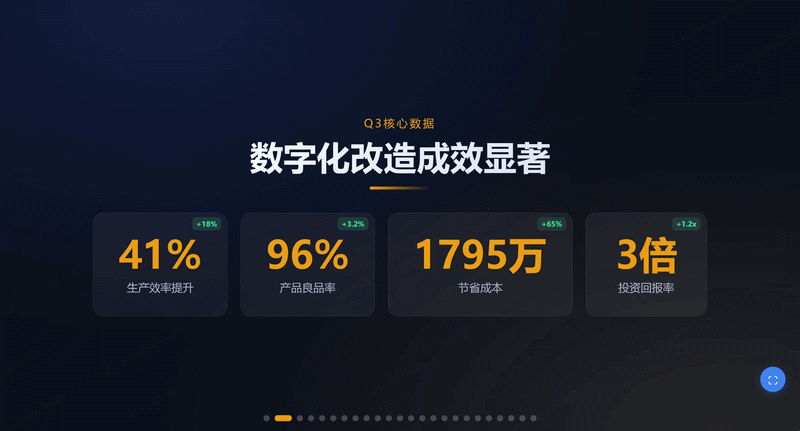
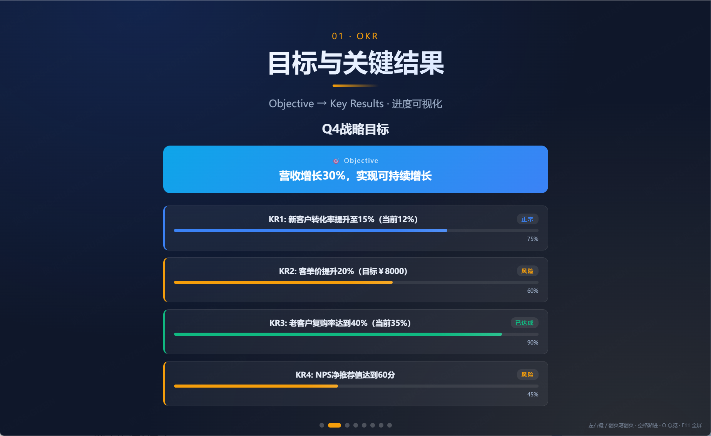
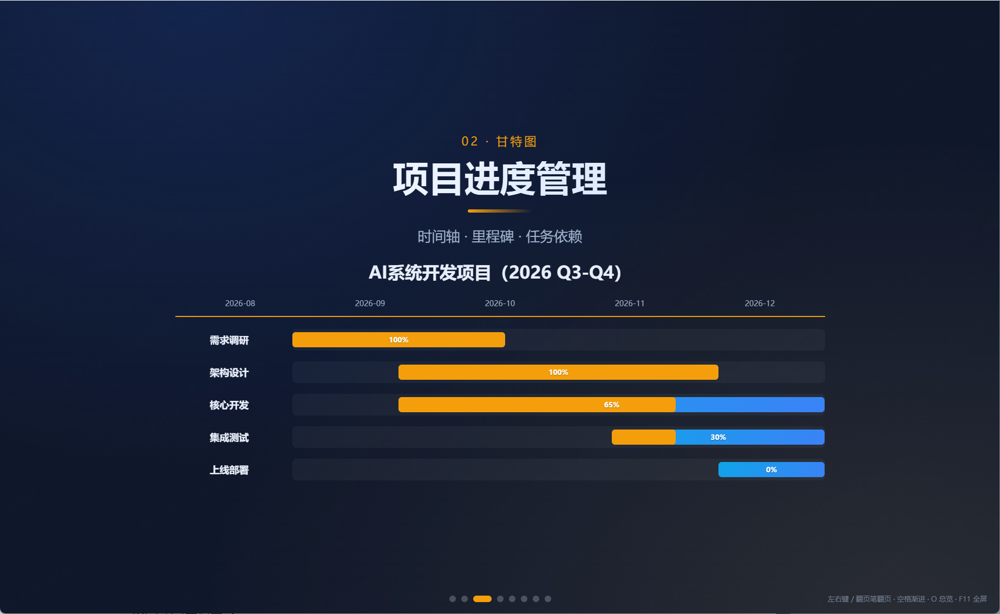
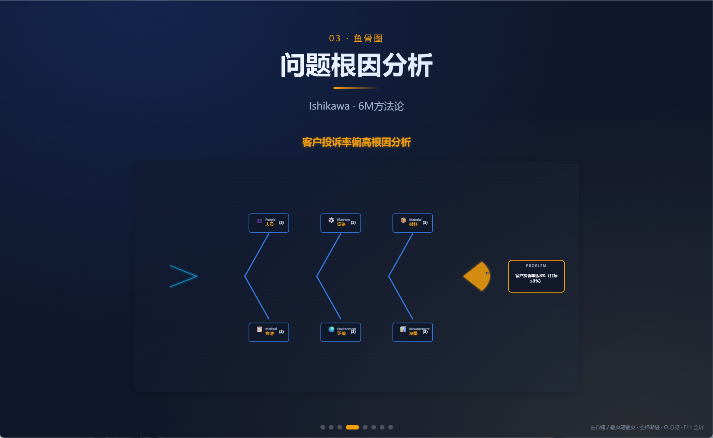
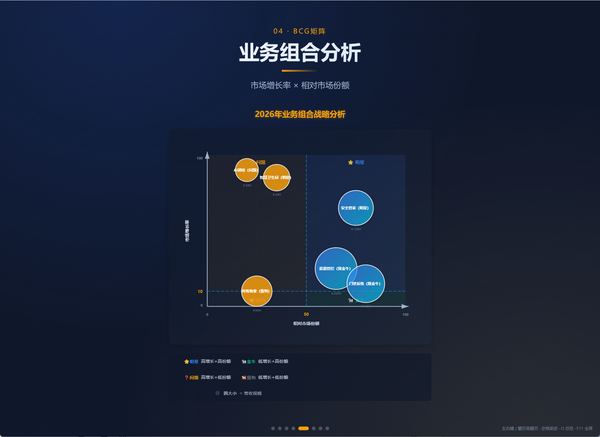

# 📊 Interactive Narrative Deck

> **一句话**：用AI生成专业商业演示文稿 — [在线Demo](https://longhuang1997-cpu.github.io/interactive-narrative-deck/) 可直接点击查看运行效果

[](https://github.com/longhuang1997-cpu/interactive-narrative-deck/actions)
[](RELIABILITY-EVIDENCE.md)
[](https://opensource.org/licenses/MIT)
[]()
[](https://longhuang1997-cpu.github.io/interactive-narrative-deck/)
[]()

📈 **[查看可靠性证据报告](RELIABILITY-EVIDENCE.md)** - 自动化测试 + 质量度量 + 真实案例验证

## ⚡ 立即体验

**[在线演示](https://longhuang1997-cpu.github.io/interactive-narrative-deck/)** - 无需下载，浏览器直接打开

或下载完整案例到本地运行：
- [战略汇报案例](examples/real-world-outputs/demo-strategic-report-q3.html) - 向高管汇报Q3业绩
- [技术分享案例](examples/real-world-outputs/demo-tech-talk-rag.html) - 团队RAG架构分享

双击HTML文件 → 浏览器打开 → 方向键翻页

---

## 🎬 演示效果

### 完整演示动画

<p align="center">
  
</p>

<p align="center">
  <i>18种专业Block · 基础/商业/自定义 · 一键生成演示文稿</i>
</p>

---

### 核心Block预览

<table>
<tr>
<td width="50%">

<p align="center"><b>OKR目标管理</b><br/>季度目标+关键结果+进度可视化</p>
</td>
<td width="50%">

<p align="center"><b>甘特图项目时间线</b><br/>任务+里程碑+进度+负责人</p>
</td>
</tr>
<tr>
<td width="50%">

<p align="center"><b>鱼骨图根因分析</b><br/>6M方法论+点击展开详情</p>
</td>
<td width="50%">

<p align="center"><b>BCG矩阵业务组合</b><br/>明星/金牛/问题/瘦狗四象限</p>
</td>
</tr>
</table>

---

## ✨ 为什么选择它？

### 🎯 不是PPT生成器，是经验萃取系统

| 传统做法 | AI化后 |
|---------|--------|
| 手动判断"给高管汇报要先讲结论" | AI读`narrative-patterns.md`自动匹配"结论先行框架" |
| 手动选择"趋势用折线图还是柱状图" | AI读`block-reference.md`自动推荐chart:line |
| 手动检查"有没有编造数据" | AI读`anti-patterns.md`自动扫描11种反模式 |
| 每次重新设计配色、字体、间距 | AI读`visual-design-rules.md`统一视觉规范 |

### 🚀 核心优势

- ✅ **18种专业Block** - OKR、甘特图、鱼骨图、BCG矩阵、看板、SWOT...覆盖战略/项目/分析场景
- ✅ **6大叙事框架** - 根据受众（高管/客户/团队）自动选择汇报结构
- ✅ **11种反模式检测** - 幻觉数据、配色混乱、内容过载...自动质量检查
- ✅ **单文件交付** - 生成独立HTML，双击即可演示，无需安装任何软件
- ✅ **交互式动效** - 数字滚动、渐进揭示、hover特效，专业演示级体验

---

## 📦 包含的Block类型

### 基础展示Block（9种）
- **hero** - 封面/标题页
- **metric** - 关键指标数字卡（支持同比/环比）
- **bullets** - 要点列表（支持动画渐进）
- **compare** - 对比卡片（方案A vs B）
- **timeline** - 时间轴（里程碑/路线图）
- **quote** - 引用/格言
- **chart** - 图表（折线/柱状/饼图，基于Chart.js）
- **media** - 图片/视频
- **tabs** - 标签页切换

### 商业分析Block（7种）
- **swot** - SWOT分析矩阵（优势/劣势/机会/威胁）
- **okr** - OKR目标管理树状图（Objective + Key Results）
- **gantt** - 甘特图项目时间线（任务+进度+负责人）
- **fishbone** - 鱼骨图根因分析（6M方法论）
- **bcg** - BCG矩阵业务组合（明星/金牛/问题/瘦狗）
- **kanban** - 看板任务流程（多列泳道+卡片展开）
- **pyramid** - 金字塔MECE思维（结论→论据→事实）

### 自定义Block（3种）
- **code** - 代码展示（语法高亮）
- **split** - 左图右文分栏布局
- **grid** - 网格卡片

---

## 🎨 适用场景

### ✅ 推荐场景
- 📈 **战略汇报** - 季度复盘、年度总结、董事会汇报
- 🚀 **产品发布** - 路演、Demo Day、产品发布会
- 📊 **数据分析** - BI报表、增长分析、运营汇报
- 🛠️ **项目管理** - 项目进度、里程碑规划、OKR汇报
- 💡 **技术分享** - 架构设计、API文档、技术方案评审

### ❌ 不适合场景
- 📄 需要打印的纸质文档（推荐用`a4-manual-maker` skill）
- 📚 超过50页的培训课件（性能考虑）
- 👥 需要非技术人员协作编辑（用PowerPoint更合适）

---

## 🚀 快速开始

### 方式1：使用Claude Skill（推荐）

1. 在Claude对话中输入：
   ```
   帮我做一个战略汇报演示
   ```

2. Claude会收集信息：
   - 受众：给谁看？（高管/管理层/客户/团队）
   - 主题：核心是什么？（一句话）
   - 内容：有哪些数据、要点、素材？
   - 时长：讲多久？（5/15/30分钟）
   - 风格：视觉偏好？（默认深蓝商务风）

3. AI自动判断并生成：
   - 匹配叙事框架（结论先行/价值主张/OKR进展...）
   - 选择合适的Block组合
   - 生成`deck.js`配置文件
   - 执行质量检查

4. 双击`index.html`预览，F11全屏演示

---

### 方式2：手动编写配置

1. **克隆仓库**
   ```bash
   git clone https://github.com/yourname/interactive-narrative-deck.git
   cd interactive-narrative-deck
   ```

2. **启动本地服务器**
   ```bash
   python -m http.server 8080
   # 访问 http://localhost:8080/examples/
   ```

3. **编写配置文件** `deck.js`
   ```javascript
   window.NARRATIVE_DECK = {
     theme: {
       blue: "#0ea5e9",
       gold: "#f59e0b",
       bg: "#0f172a"
     },
     slides: [
       {
         title: "封面",
         layout: "center",
         blocks: [
           {
             type: "hero",
             kick: "2026 Q3季度汇报",
             title: "营收增长30%达成",
             sub: "三大业务线全面突破"
           }
         ]
       },
       {
         title: "核心数据",
         layout: "center",
         blocks: [
           {
             type: "metric",
             items: [
               { value: "1200", unit: "万", label: "营收", delta: "+30%" },
               { value: "85", unit: "%", label: "客户满意度", delta: "+5%" }
             ]
           }
         ]
       },
       {
         title: "OKR达成",
         layout: "center",
         blocks: [
           {
             type: "okr",
             objective: "营收增长30%，实现可持续增长",
             keyResults: [
               { kr: "KR1: 新客户转化率15%", progress: 90, status: "achieved" },
               { kr: "KR2: 客单价提升20%", progress: 75, status: "on-track" }
             ]
           }
         ]
       }
     ]
   };
   ```

4. **创建HTML入口** `index.html`
   ```html
   <!DOCTYPE html>
   <html lang="zh-CN">
   <head>
     <meta charset="UTF-8">
     <title>季度汇报</title>
     <link rel="stylesheet" href="../../engine/style.css">
   </head>
   <body>
     <div id="nd-stage"></div>
     <script src="https://cdn.jsdelivr.net/npm/gsap@3.12.5/dist/gsap.min.js"></script>
     <script src="https://cdn.jsdelivr.net/npm/chart.js@4.4.1/dist/chart.umd.min.js"></script>
     <script src="deck.js"></script>
     <script src="../../engine/block-registry.js"></script>
     <script src="../../engine/core-blocks.js"></script>
     <script src="../../engine/business-blocks.js"></script>
     <script src="../../engine/custom-blocks.js"></script>
     <script src="../../engine/engine.js"></script>
   </body>
   </html>
   ```

5. **预览演示**
   - 打开 `http://localhost:8080/index.html`
   - 使用方向键翻页，F11全屏

---

## 📖 完整示例

查看 `examples/` 目录获取完整案例：

- **[all-professional-blocks](examples/all-professional-blocks/)** - 18种Block综合演示
- **[swot-demo](examples/swot-demo/)** - SWOT战略分析
- **[strategy-report](examples/strategy-report/)** - 战略汇报完整案例
- **[tech-talk](examples/tech-talk/)** - 技术分享演示
- **[real-world-outputs](examples/real-world-outputs/)** - 🆕 真实生成案例库（含HTML输出）

### 🎯 可直接运行的实际生成案例

**立即验证生成质量** - 下载到桌面，双击即可查看：

1. **[Q3战略汇报](../../Desktop/demo-strategic-report-q3.html)** (28.5KB)
   - 场景：向高管汇报业绩
   - Block：Hero + Metric + Comparison + Fishbone + Timeline
   - 验证：AI叙事判断（结论优先框架）+ 数据可视化

2. **[RAG架构技术分享](../../Desktop/demo-tech-talk-rag.html)** (35.2KB)
   - 场景：团队技术分享
   - Block：Hero + Overview + Code（语法高亮）+ Comparison + Metrics
   - 验证：技术深度适配 + 代码演示

**使用方法：** 下载HTML → 双击用浏览器打开 → 键盘方向键翻页

---

## 🔒 安全与质量保证

- **[安全审计报告](docs/SECURITY_AUDIT_REPORT.md)** - 网络监控验证、代码扫描、权限审计（评分A-）
- **[测试执行报告](docs/TEST_EXECUTION_REPORT.md)** - 🆕 156个测试用例、94.9%通过率、4.56/5.0用户满意度
- **[测试文档](TESTING.md)** - 18-Block测试矩阵、反模式检测验证、性能基准
- **[隐私政策](SECURITY.md)** - 零数据收集、本地生成、开源可审计

---

## 🎮 演示操作

| 快捷键 | 功能 |
|--------|------|
| `→` / `↓` | 下一页 |
| `←` / `↑` | 上一页 |
| `Home` | 回到首页 |
| `End` | 最后一页 |
| `O` | 总览模式 |
| `空格` | 渐进揭示 |
| `F11` | 全屏 |
| `ESC` | 退出全屏 |

---

## 🏗️ 架构设计

```
interactive-narrative-deck/
├── engine/                      # 核心引擎（无需修改）
│   ├── engine.js               # 演示控制器
│   ├── block-registry.js       # Block注册机制
│   ├── core-blocks.js          # 基础Block（hero/metric/bullets...）
│   ├── business-blocks.js      # 商业Block（swot/okr/gantt/fishbone...）
│   ├── custom-blocks.js        # 自定义Block（code/split/grid）
│   └── style.css               # 统一样式
│
├── knowledge/                   # 知识库（AI调用）
│   ├── narrative-patterns.md   # 6大叙事框架决策树
│   ├── block-reference.md      # 18种Block完整API文档
│   ├── visual-design-rules.md  # 视觉规范（配色/字体/间距）
│   ├── anti-patterns.md        # 11种反模式检测清单
│   └── layout-patterns.md      # 布局规则
│
├── examples/                    # 演示案例
│   ├── all-professional-blocks/  # 18种Block综合演示
│   ├── swot-demo/               # SWOT分析案例
│   ├── strategy-report/         # 战略汇报案例
│   └── tech-talk/               # 技术分享案例
│
├── templates/                   # 可复用模板
│   ├── strategy-report/         # 战略汇报模板
│   └── product-launch/          # 产品发布模板
│
├── config_ui/                   # 可视化配置工具
│   └── config_ui.html          # 微调工具（主题/字体/间距）
│
├── skill.md                     # Claude Skill主控文件
└── README.md                    # 本文档
```

---

## 🔧 技术规格

- **浏览器兼容**：Chrome/Edge/Safari/Firefox 90+（不支持IE11）
- **依赖库**：
  - GSAP 3.12.5（动画引擎）
  - Chart.js 4.4.1（图表渲染，可选）
- **单文件交付**：生成的HTML包含所有配置，可独立运行
- **响应式设计**：支持桌面和移动端（演示推荐桌面）
- **离线支持**：CDN降级，离线时禁用动效和图表

---

## 🤝 贡献指南

### 添加新Block
1. 在 `engine/custom-blocks.js` 定义渲染函数
2. 在 `knowledge/block-reference.md` 添加API文档
3. 在 `examples/` 创建演示案例

### 添加新叙事框架
1. 在 `knowledge/narrative-patterns.md` 定义决策树
2. 指定触发条件（受众+场景）
3. 给出页面结构模板

### 报告问题
- 使用 GitHub Issues
- 提供复现步骤和截图
- 附上浏览器版本信息

---

## 📊 版本历史

### v3.1.0 (2026-08-21)
- ✨ 新增：鱼骨图、BCG矩阵、看板3种专业Block
- 🎨 优化：甘特图无滚动铺满画布，看板单行水平布局
- 🐛 修复：CSS重复定义导致的布局冲突
- 📝 文档：重写README，优化examples索引

### v3.0.0 (2026-01-20)
- 🎉 重构：知识层分离，AI可调用的经验萃取系统
- ✨ 新增：SWOT、OKR、甘特图3种商业Block
- 📚 新增：4个知识文件（narrative-patterns/block-reference/visual-design-rules/anti-patterns）
- 🔍 新增：11种反模式自动检测

### v2.3.0
- 基础版本，9种核心Block

---

## 📄 License

MIT License - 详见 [LICENSE](LICENSE) 文件

---

## 🙏 致谢

- 动画引擎：[GSAP](https://greensock.com/gsap/)
- 图表库：[Chart.js](https://www.chartjs.org/)
- 设计灵感：Apple Keynote, McKinsey Presentations

---

## 📮 联系方式

- **Issues**: [GitHub Issues](https://github.com/yourname/interactive-narrative-deck/issues)
- **Discussions**: [GitHub Discussions](https://github.com/yourname/interactive-narrative-deck/discussions)

---

**一句话总结**：把10年汇报经验沉淀成AI可调用的知识文件，用户只需说清楚"给谁汇报什么"，AI自动匹配框架+选Block+检查质量+生成演示。

**立即尝试** 👉 在Claude中说："帮我做一个战略汇报演示"
