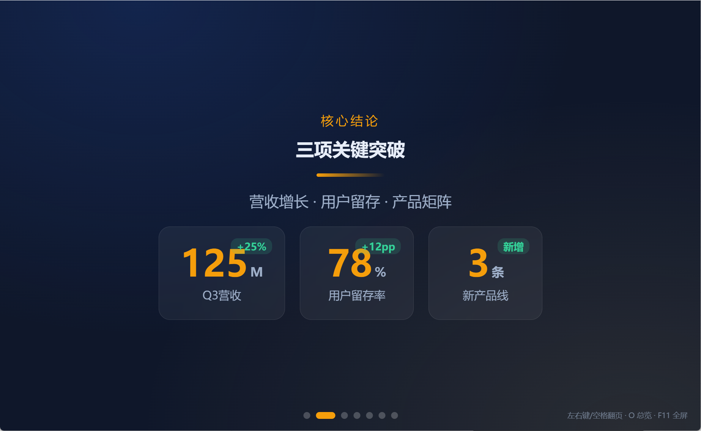
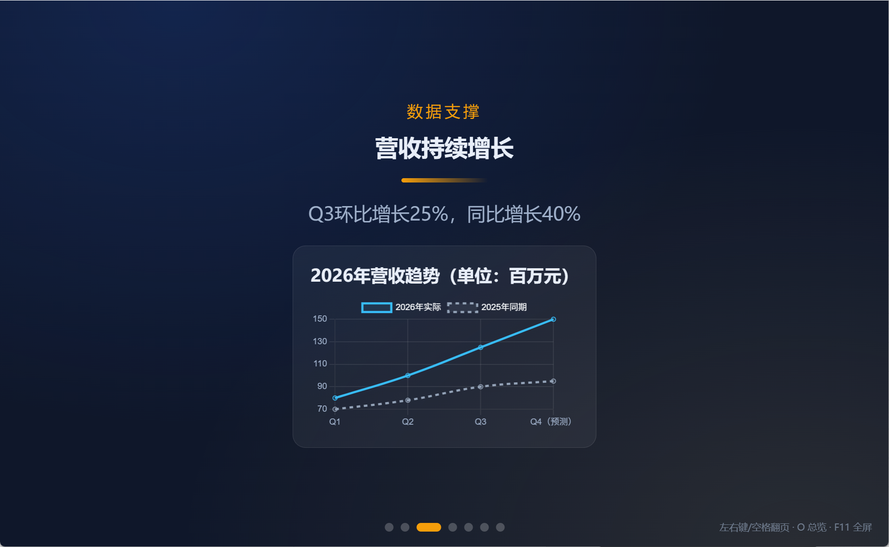
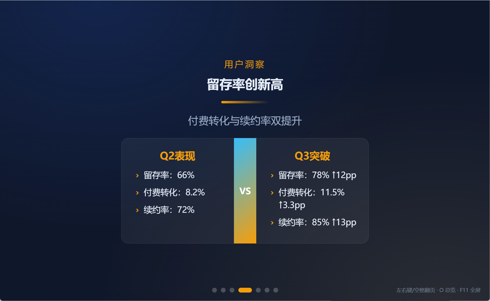

# Interactive Narrative Deck

> 把汇报做成Block积木式交互演示——渐进揭示+数据可视化+克制动效  
> 区别于静态PPT和娱乐游戏，定位职场正式场合的高级演讲


## 📸 快速预览

### 🎬 完整演示


*7页完整演示：封面 → 数字指标 → 折线图 → 左右对比 → 时间线 → 要点列表 → 金句收尾*

<details>
<summary><b>👁️ 点击查看高清截图</b></summary>

### P1 - 封面


### P2 - 数字指标卡片


### P3 - 折线图数据对比


### P4 - 左右对比卡片


### P5 - 时间线路线图


### P6 - 渐进揭示要点


### P7 - 金句收尾


</details>

**🎯 立即验证**：双击打开 [`examples/strategy-report-standalone.html`](examples/strategy-report-standalone.html)（无需安装任何依赖）

## 🚀 3分钟快速开始

### 1️⃣ 安装skill

```bash
# 方式1：Claude Code安装（推荐）
claude skill install https://github.com/longhuang1997-cpu/interactive-narrative-deck

# 方式2：手动克隆
git clone https://github.com/longhuang1997-cpu/interactive-narrative-deck.git
cd interactive-narrative-deck
```

### 2️⃣ 调用生成

在Claude Code中说：

```
我要做个战略汇报演示，给高管看的，主题是Q3业务复盘，
数据有：营收增长25%、用户留存率78%、新增3个产品线。
```

Claude会自动：
- ✅ 判断叙事框架（高管=结论优先）
- ✅ 选择合适Block（数字用metric，趋势用line图）
- ✅ 生成完整HTML到桌面

### 3️⃣ 预览使用

```bash
# 双击打开
index.html

# 快捷键
左右键/PageUp/PageDown  # 翻页
空格                    # 渐进揭示
O                       # 总览模式
F11                     # 全屏演示
```

**🎬 [查看Demo效果](https://github.com/longhuang1997-cpu/interactive-narrative-deck/tree/main/examples)**

---

## ✨ 核心价值

### 不是工具，是汇报经验的AI化萃取

优秀汇报者积累10年的判断力——向高管要先结论、数据对比用图不用表、问题拆解配合演讲节奏——这些隐性经验，由AI代为执行。

### 对比传统PPT

| 维度 | PowerPoint | Interactive Deck |
|------|-----------|------------------|
| 制作时间 | 2-4小时 | 30-60分钟 ⏱️ |
| 数据更新 | 逐页复制粘贴 | 改1处刷新 🔄 |
| 交互性 | 静态翻页 | 实时图表+渐进 🎯 |
| 版本控制 | final_v2_真最终 | Git diff 📦 |
| 跨平台 | 需Office | 浏览器即可 🌐 |

**真实场景**：  
高管要求"把上周数据改成本周" → PPT需30分钟重新对齐，Deck改1处1分钟刷新 ✅

---

## 🧩 Block积木清单

### 内置Block（9种）

| Block | 用途 | 最佳场景 |
|-------|------|---------|
| `hero` | 封面/章节标题 | 每页开头、过渡页 |
| `metric` | 数字指标（带滚动动效） | KPI展示、数据对比 |
| `bullets` | 要点列表（支持渐进揭示） | 问题分析、行动计划 |
| `compare` | 左右对比 | 方案选型、优劣对比 |
| `timeline` | 时间线/路线图 | 项目进度、发展历程 |
| `quote` | 金句/引用 | 行动号召、记忆点 |
| `chart` | 图表（line/bar/pie/doughnut） | 趋势分析、占比构成 |
| `tabs` | 标签页切换 | 多方案并列、深度展开 |
| `media` | 图片/视频 | 产品截图、演示视频 |

### 🔌 插件化架构（v2.0.3+）

从v2.0.3开始，Block采用插件化注册机制，**用户可以扩展自定义Block而无需修改engine.js**：

```javascript
// 注册自定义Block
BlockRegistry.register('accordion', function(data) {
  const div = document.createElement('div');
  div.className = 'nd-accordion';
  // 自定义渲染逻辑...
  return div;
}, {
  description: 'FAQ折叠面板',
  author: 'yourname'
});

// 在deck.js中使用
{type: 'accordion', items: [{title: '...', content: '...'}]}
```

**扩展Block指南**：[docs/BLOCK_EXTENSION_GUIDE.md](./docs/BLOCK_EXTENSION_GUIDE.md)

**示例自定义Block**：[engine/custom-blocks.js](./engine/custom-blocks.js)（accordion/progress/alert）

**组合示例**：
```javascript
[
  {type: "hero", title: "Q3业务复盘"},
  {type: "metric", items: [{value: "25%", label: "营收增长"}]},
  {type: "chart", chartType: "line", data: {...}},
  {type: "bullets", items: ["问题1", "问题2"], stagger: true}
]
```

---

## 📚 完整案例

### 战略汇报（给高管）
- **结构**：封面→结论→数据→行动
- **页数**：≤6页
- **特点**：数字用metric，先结论后过程
- **[查看源码](./examples/strategy-report/)**

### 技术分享（给团队）
- **结构**：背景→方案→Demo→Q&A
- **页数**：8-12页
- **特点**：代码示例用tabs，架构图用media
- **[查看源码](./examples/tech-talk/)**

### 产品发布会（给客户）
- **结构**：痛点→解法→证明→行动
- **页数**：10-15页
- **特点**：视觉冲击，文字从简
- **[查看源码](./examples/product-launch/)**

---

## 🛠️ 进阶定制

### 修改配色
```javascript
// deck.js
const PAGE_CONFIG = {
  bgColor: "#0F172A",      // 背景色
  textColor: "#F8FAFC",    // 文字色
  accentColor: "#38BDF8",  // 强调色
  chartColors: ["#38BDF8", "#F59E0B", "#10B981"]
}
```

### 可视化微调工具
```bash
# 打开配置器
open config_ui/config_ui.html

# 调整：
- 字体大小
- 动画速度
- 渐进揭示时机
- 图表配色
```

### CDN离线备份
```bash
# 下载到本地（可选）
mkdir vendor
curl -o vendor/gsap.min.js https://cdn.jsdelivr.net/npm/gsap@3.12.2/dist/gsap.min.js
curl -o vendor/chart.min.js https://cdn.jsdelivr.net/npm/chart.js@4.4.0/dist/chart.umd.min.js

# 修改index.html引用路径
```

---

## 🔒 权限与安全

- ✅ 只读用户提供的素材，无文件系统访问
- ✅ 纯本地生成HTML，无数据上传
- ✅ CDN失败自动降级到CSS动画
- ✅ 用户输入经过HTML转义
- ⚠️ 敏感数据建议用【待填入】占位，生成后手动填写

---

## 🤝 适合与不适合场景

**✅ 适合**：
- 向高管/董事会汇报（结论优先、数据驱动）
- 产品路演/技术分享（交互演示）
- 数据复盘/战略研讨（实时图表）
- 需要频繁更新数据的场景（Git版本控制）

**❌ 不适合**：
- 需要打印成纸质文档（→ 用A4手册skill）
- 分发给非技术同事编辑（→ 用PPT）
- 超过50页的大型培训（性能考虑）

---

## 📖 文档导航

- [SKILL.md](./SKILL.md) - Claude调用的完整skill定义（含汇报经验库）
- [CHANGELOG.md](./CHANGELOG.md) - 版本历史
- [examples/](./examples/) - 完整案例源码
- [knowledge/](./knowledge/) - Block参考手册、布局模式、反幻觉规范

---

## 🐛 故障排查

| 问题 | 解决方案 |
|-----|---------|
| 图表不显示 | 检查`datasets`是否为数组：`datasets: [{...}]` |
| 渐进揭示失效 | 网络问题导致GSAP未加载，添加本地备份 |
| 翻页笔无响应 | 退出全屏重试，或用左右方向键 |
| 中文乱码 | 文件另存为UTF-8编码 |

[查看完整FAQ](./knowledge/troubleshooting.md)

---

## 📄 License

MIT © longhuang1997-cpu

---

## 🙏 致谢

灵感来源：
- [Slack Block Kit](https://api.slack.com/block-kit) - Block积木设计理念
- [Figma微交互](https://www.figma.com/) - 克制动效美学
- [reveal.js](https://revealjs.com/) - Web演示框架

---

**一句话**：AI负责判断，用户负责提供内容，engine负责渲染。

**[⭐ Star本项目](https://github.com/longhuang1997-cpu/interactive-narrative-deck) | [🐛 提交Issue](https://github.com/longhuang1997-cpu/interactive-narrative-deck/issues) | [📧 联系作者](mailto:your-email@example.com)**
